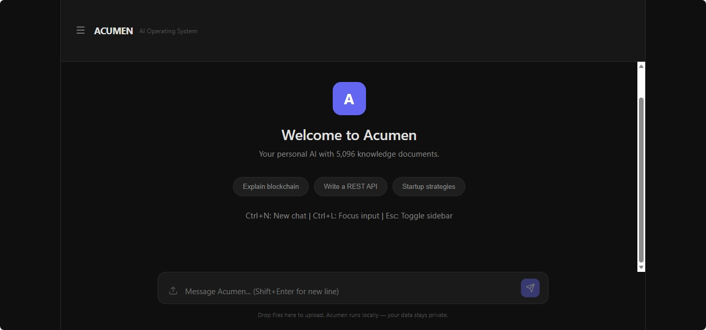

\# Acumen


\*\*A local-first personal AI operating system — private, self-hosted, and running entirely on a single laptop.\*\*




Acumen is a fully private AI system that runs on your own machine with no cloud dependency and no data ever leaving the device. It coordinates a crew of specialized AI agents, a layered memory system, a searchable knowledge base, and a secure code sandbox — all behind a local web interface and a Telegram bot.


It was built from scratch on modest hardware (an Intel i3 laptop with no dedicated GPU) to prove that a capable, private AI assistant doesn't need the cloud.


> ⚠️ \*\*Private by design.\*\* This repository contains the \*code\* for Acumen. It does \*\*not\*\* include any secrets, personal data, memories, or knowledge-base contents — those live only on the host machine and are excluded via `.gitignore`.


\---


\## Design Principles


\- 🏠 \*\*Local first\*\* — Everything runs on the machine. No cloud required.

\- 🚫 \*\*Zero telemetry\*\* — No tracking, no analytics, no data sharing. Ever.

\- 🔒 \*\*Privacy by design\*\* — Secrets live in a local `.env` file (never committed). Services bind to `localhost` only.

\- 🌱 \*\*Green computing\*\* — Minimal resource use; models unload when idle; worker count matches CPU cores.

\- 🛡️ \*\*Security by default\*\* — Default-deny file access, sandboxed code execution, and a full audit trail.


\---


\## Architecture


Acumen is built in layers, each depending on the ones beneath it.


\*\*Core\*\* — Configuration, structured logging, a universal LLM client, and text utilities, plus an agentic reasoning loop, a context engine, and a self-correction module.


\*\*Security\*\* — A permission system that denies file access by default, an audit log that records every action, and a Docker-based sandbox that isolates any code the system runs.


\*\*Memory\*\* — A layered memory system: \*working\* (short-term), \*episodic\* (conversation history), and \*semantic\* (long-term knowledge), tied together by a manager, with automatic summarization and a user profile.


\*\*Knowledge Base\*\* — A local vector database (ChromaDB) with an ingestion pipeline, so agents can search stored knowledge by meaning rather than exact keywords.


\*\*Tools\*\* — A secured toolkit the agents can use: web search, file read/write, a sandboxed code runner, knowledge query, web scraper, image reader, voice, and backup — every call permission-checked and audit-logged.


\*\*Agents\*\* — A crew of specialized agents, each with its own role and toolset: researcher, engineer, debugger, code reviewer, strategist, automator, knowledge agent, and security agent — all built on a shared base class.


\*\*Crews\*\* — Agents team up into crews to tackle multi-step tasks that no single agent handles alone.


\*\*DAG Engine\*\* — A high-performance task engine: a Rust scheduler plans work as a dependency graph (DAG) and Go workers execute tasks in parallel, communicating over a Protocol Buffers interface. Worker count matches the CPU core count.


\*\*Metagraph\*\* — An orchestration layer (model, engine, bootstrap) that ties the whole system together.


\*\*Router\*\* — Classifies each incoming request and routes it to the right agent, crew, or workflow.


\*\*Interfaces\*\* — A FastAPI web API with a React + Vite frontend, plus a Telegram bot for controlling Acumen from a phone — all local.


\---


\## Tech Stack


| Layer | Technology |

|---|---|

| Core logic | Python |

| Scheduler | Rust |

| Workers | Go |

| Web UI | React + Vite |

| Model runtime | Ollama (local) |

| Vector store | ChromaDB |

| Sandbox | Docker |

| Web API | FastAPI |


\### Local Models (via Ollama)


\- \*\*Fast:\*\* `qwen2.5:3b`

\- \*\*Reasoning:\*\* `qwen2.5:7b`

\- \*\*Code:\*\* `qwen2.5-coder:7b`

\- \*\*Vision:\*\* `moondream`

\- \*\*Embeddings:\*\* `nomic-embed-text`


\---


\## Hardware Target


Acumen is tuned to run on a lightweight, CPU-only machine:


\- \*\*CPU:\*\* Intel i3-1215U (6 cores)

\- \*\*RAM:\*\* 32 GB

\- \*\*GPU:\*\* none — CPU-only inference

\- \*\*Storage:\*\* \~1 TB


\---


\## Project Structure


```

acumen/

├── acumen/            # Main Python package

│   ├── core/          # Config, logging, LLM client, reasoning

│   ├── security/      # Permissions, audit, sandbox

│   ├── memory/        # Working, episodic, semantic memory

│   ├── vectordb/      # Knowledge base ingestion

│   ├── tools/         # Agent toolkit (web, files, code, etc.)

│   ├── agents/        # Specialized agents + crews

│   ├── metagraph/     # Orchestration layer

│   ├── router/        # Request classification \& routing

│   ├── interface/     # Web API + Telegram bot

│   └── workflows/     # Multi-step task flows

├── engine/            # DAG engine

│   ├── scheduler/     # Rust scheduler

│   └── worker/        # Go workers

├── web/               # React + Vite frontend

├── sandbox/           # Docker sandbox definition

└── requirements.txt   # Python dependencies

```


\---


\## Running Acumen


Requires local prerequisites: \*\*Python, Docker, Rust, Go, Node.js,\*\* and \*\*Ollama\*\*.


1\. Create a `.env` file in the project root with your settings (this file is never committed).

2\. Install Python dependencies: `pip install -r requirements.txt`

3\. Pull the required models with Ollama.

4\. Start the system: `start\_acumen.bat`


\---


\## Status \& License


Acumen is a personal project, built step by step from scratch. It's shared here as a working reference for a private, local-first AI architecture.


No license is currently applied — all rights reserved by the author.

